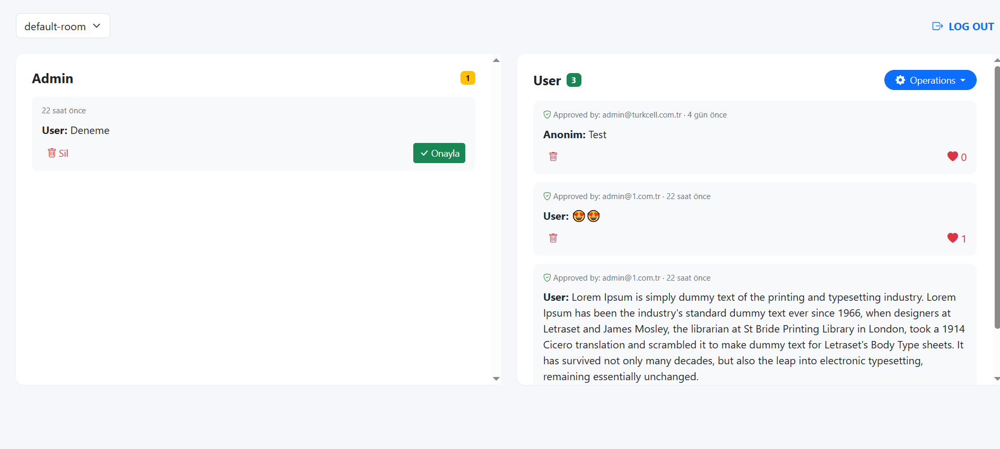

# ChatPanel

Kullanıcı arayüzü **React + Vite** ile, panel ise **ASP.NET Core MVC** ile geliştirilmiştir.

## Genel Bakış

1. Kullanıcı mesaj gönderir → Firebase'e `isApproved: false` olarak kaydedilir
2. Mesaj kullanıcı ekranlarında **görünmez** — yönetici panelinde "Onay Bekleyen" listesine düşer
3. Yönetici panelden **Onayla** butonuna basar ve mesaj tüm kullanıcı ekranlarına anında yayınlanır
4. Yönetici hiçbir kullanıcıya gösterilmeden uygunsuz mesajları **silebilir**

Etkinliklerde canlı yayın chat'i, müşteri sorularının filtrelenmesi, spam ve hakaret koruması gerektiren senaryolar için uygundur.

---

## Ekran Görüntüleri

> Panel Ana Ekran

